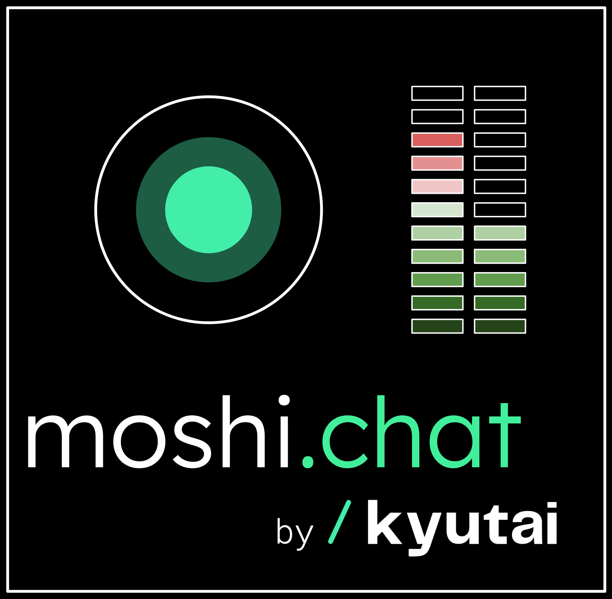
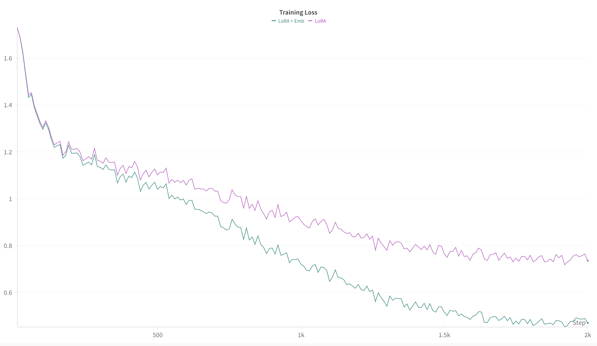

# Moshi-Finetune (Modified for the DSAA architecture)

> **Note:** This repository is a fork and significant modification of [kyutai-labs/moshi-finetune](https://github.com/kyutai-labs/moshi-finetune), adapted for research purposes as part of my diploma thesis.  
> **Original authors retain copyright** for their code; see [Acknowledgments](#acknowledgments).

## About This Repository

This repository contains code and experiments for my diploma thesis, which explores architectural modifications to the Moshi model.  
It is based on the official Moshi finetuning repository, but **includes substantial changes** to both the training pipeline and the underlying Moshi model code.

### Key Differences from Upstream

- **Custom Moshi Implementation:**  
  The `moshi/` directory contains a modified version of the Moshi library.  
  **To use these changes, you must replace your environment’s installed Moshi package** (e.g., `.venv/lib/python3.11/site-packages/moshi`) with this directory.  
  This is necessary for development and to enable the architectural changes described in my thesis.

- **Experimental Modules:**  
  All custom modules used in experiments are implemented in `modules.py`.

- **Scripts for Experiments and Analysis:**  
  The `scripts/` directory contains various utilities and experiment scripts:
    - `ae_train.py` — Training script for the autoencoder.
    - `analyze_state.py` — Script for analyzing model states.
    - `get_hidden_states.py` — Extracts hidden states for latent space analysis.
    - `analyze_states.py` — Performs latent space analysis.
    - `fix_alignments.py` — Fixes alignment issues in Whisper timestamps (addresses cases where initial timestamps are too long).
    - `compare_evals.py` — Compares benchmark results across models to identify patterns.
    - `loss_landscape.py` — Performs loss landscape analysis.
    - ...and more.

For details on the modifications and experimental setup, please refer to the accompanying thesis document.

## Usage

To use the modified DSAA architecture, follow these steps:

1. **Download the Original DSAA Model Weights:**  
   Download the pretrained DSAA model weights (`.safetensors` file) from [https://huggingface.co/Cucvui/dsaa](https://huggingface.co/Cucvui/dsaa).  
   Place the file in a directory of your choice (e.g., `weights/dsaa.safetensors`).

2. **Create and Edit a Configuration File:**  
   Set up a `.yaml` configuration file in the `/example` directory.  
   See `example/qwen.yaml` for a template.  
   In your config, you **must** point to the downloaded weights using the `moshi_paths.moshi_path` key:
   ```yaml
   moshi_paths:
     moshi_path: "weights/dsaa.safetensors"
   ```
   You can also specify other options, such as which text LLM to use under the `text_llm` section (e.g., set `hf_repo_id` to your desired Hugging Face model).

3. **(Optional) Set Up a New Model:**  
   If you want to make architectural changes (e.g., change the text LLM), run:
   ```sh
   uv run torchrun --nproc-per-node 1 -m setup_new_model example/qwen.yaml
   ```
   This will initialize the new model and save its weights to `weights/model.safetensors`.  
   **Note:** This step is optional if you only want to use or fine-tune the original DSAA model.

4. **Train or Use the Model:**  
   You can now proceed to training or other tasks using the weights specified in your config.  
   For example, to start training:
   ```sh
   uv run torchrun --master_port=$MASTER_PORT --nproc-per-node 1 -m train example/qwen.yaml
   ```

**Notes:**  
- The original DSAA model weights are always required, even if you skip the setup step.
- Adjust the configuration file as needed for your experiment.
- Run `setup_new_model.py` only if you want to reinitialize or modify the model (e.g., change the text LLM).
- Below is the original README from the upstream repository for reference.

## Citing and Acknowledgments

This repository is heavily based on [kyutai-labs/moshi-finetune](https://github.com/kyutai-labs/moshi-finetune) and [kyutai-labs/moshi](https://github.com/kyutai-labs/moshi).  
Please cite their work if you use this codebase.

> This project uses code from [mistral-finetune](https://github.com/mistralai/mistral-finetune) licensed under the Apache License 2.0.

---

## Original README

> The following section is the original README from [kyutai-labs/moshi-finetune].  
> Please refer to it for standard usage instructions and details.

# Moshi-Finetune

<a target="_blank" href="https://colab.research.google.com/github//kyutai-labs/moshi-finetune/blob/main/tutorials/moshi_finetune.ipynb">
  
</a>

<p align="center">
  
</p>

**Moshi-Finetune** provides an easy way to fine-tune [Moshi models](https://github.com/kyutai-labs/moshi)
using **LoRA (Low-Rank Adaptation)** for lightweight and efficient training. This guide walks you through
installation, model downloading, dataset preparation, training, and inference. By following these steps,
you'll be able to: transform stereo audio files into your very own transcribed dataset, fine-tune
[moshi weights](https://huggingface.co/kyutai/moshiko-pytorch-bf16) on real conversations, and—best of
all—chat with your customized moshi model!

## 📥 Installation

_You can also follow along interactively in our Colab, see link at the top._

To get started, follow these steps:

### 1️⃣ Clone this repository
```sh
git clone git@github.com:kyutai-labs/moshi-finetune.git
```

### 2️⃣ Install all required dependencies:

We recommend using [`uv`](https://docs.astral.sh/uv/) to manage the environment.
It's about 10x faster than `pip` and has a bunch of other benefits too.
Once you've installed `uv`, no explicit package installation is required:
just prefix every command with `uv run` (e.g. train using `uv run torchrun ...`).
This will automatically install the necessary dependencies based on `pyproject.toml`.

#### Installing without `uv`

If you prefer working with `pip`, and handling the install manually, you will need at least Python 3.10. 
We still advise using a virtual environment,
which can be created using [Conda](https://www.anaconda.com/docs/getting-started/miniconda/install#quickstart-install-instructions)
[virtualenv](https://virtualenv.pypa.io/en/latest/).
Then, run:

```sh
cd moshi-finetune
pip install -e .
```

## 📥 Model configuration

The training setup is specified via a YAML configuration file. The example
configuration files are located in the `example` directory.

We recommend fine-tuning one of the official moshi models. To achieve this, you
can use the following section in your configuration file.

```
moshi_paths:
   hf_repo_id: "kyutai/moshiko-pytorch-bf16"
```

## 📚 Prepare dataset

The pipeline expects a dataset of stereo audio files, the left channel is used
for the audio generated by moshi, whereas the second channel is used for the
user's input.

The files contained in the dataset should be specified in a `.jsonl` file,
where each line has the form
```json
{"path": "relative/path/to/file.wav", "duration": <duration in seconds>}
```

Each audio file should have an associated `.json` file that contains
the transcript with timestamps. These JSONs can be generated automatically, see below.

For example, the following would be a valid directory structure for a dataset:

```
data/
├── mycooldataset.jsonl
└── data_stereo
    ├── a.json
    ├── a.wav
    ├── b.json
    ├── b.wav
    ├── c.json
    └── c.wav
```

where `mycooldataset.jsonl` contains:

```jsonl
{"path": "data_stereo/a.wav", "duration": 24.521950113378686}
{"path": "data_stereo/b.wav", "duration": 18.317074829931972}
{"path": "data_stereo/c.wav", "duration": 39.38641723356009}
```

The `.jsonl` file can be generated with the snippet below. This will include
all the `.wav` files in a given directory.

```python
import sphn
import json
from pathlib import Path

paths = [str(f) for f in Path("wav-dir").glob("*.wav")]
durations = sphn.durations(paths)

with open("data.jsonl", "w") as fobj:
    for p, d in zip(paths, durations):
        if d is None:
            continue
        json.dump({"path": p, "duration": d}, fobj)
        fobj.write("\n")
```

A sample dataset in this format can be found in the
[kyutai/DailyTalkContiguous](https://huggingface.co/datasets/kyutai/DailyTalkContiguous)
repository. This 14 GB dataset can be downloaded using the following snippet:
```python
from huggingface_hub import snapshot_download

local_dir = snapshot_download(
    "kyutai/DailyTalkContiguous",
    repo_type="dataset",
    local_dir="./daily-talk-contiguous"
)
```

If you want to annotate your own dataset and generate the `.json` transcripts for each
audio file, you can use the `annotate.py` script:

```sh
python annotate.py {your jsonl file}
```

This script can also be run in a distributed manner with SLURM using e.g.
`--shards 64 --partition 'your-partition'`.

## 🏋️ Start training

Once your dataset is ready, start fine-tuning using the following steps.

#### 📌 Recommended settings for quick training:
```
lora:
  enable: true
  rank: 128
  scaling: 2.

duration_sec: 100
batch_size: 16
max_steps: 2000
```

#### 📌 Run training on a single GPU:

```sh
torchrun --nproc-per-node 1 -m train example/moshi_7B.yaml
```

Note that you should still use `torchrun` even if you're only using a single GPU.

#### 📌 Run training on multiple GPUs (8):

```sh
torchrun --nproc-per-node 8 --master_port $RANDOM -m train example/moshi_7B.yaml
```

#### 💡 Expected performance:

Using the above hyperparameters:

|  | Avg Tokens/sec   | Peak Allocated Memory   |
|------|------|------|
|   1×H100  | ≈12k| 39.6GB |
|   8×H100  | ≈10.7k| 23.7GB |


If you encounter **out-of-memory errors**, try reducing the `batch_size`. If the issue persists, you can lower the `duration_sec` parameter, but be aware that this may negatively impact the user experience during inference, potentially causing the model to become silent more quickly.

## ⚙️ Customizing training configuration

The example `moshi-finetune/example/moshi_7B.yaml` defines reasonable parameters for learning rate, weight decay, etc... but you are advised to
customize these settings for your use case.


### 🔧 Key training parameters
| Parameter              | Description |
|------------------------|-------------|
| `moshi_paths`         | Defines all the paths: `.hf_repo_id` if the model is imported from Hugging Face Hub ( `.hf_repo_id` enables to change default settings), for more information take a look at [Moshi loading](https://github.com/kyutai-labs/moshi/blob/main/moshi/moshi/models/loaders.py). |
| `run_dir`             | Directory where training checkpoints and logs are stored. |
| `duration_sec`        | Maximum sequence length (in seconds) for training. |
| `first_codebook_weight_multiplier` | The first codebook being the semantic token, we put more weight on it. | 
| `text_padding_weight` | Most of the text stream is padding as audio is 12.5Hz with mimi but tokenizing text takes less space. Decrease the loss weight on paddings to avoid the model over-focussing on predicting paddings. | 
| `gradient_checkpointing` | Whether to use gradient checkpointing per transformer layer to mitigate out of memory issues. |
| `batch_size`         | Number of training examples per GPU. |
| `max_steps`         | Total number of training steps. Defines how many iterations the training will run. **Total tokens processed = max_steps × num_gpus × batch_size × duration_seq × 9 (token per step) × 12.5 (step per second) **. |
| `optim.lr`          | Learning rate. Recommended starting value: **2e-6**. |
| `optim.weight_decay` | Weight decay for regularization. Default: **0.1**. |
| `optim.pct_start`   | Percentage of total training steps used for learning rate warm-up before decay. Equivalent to `pct_start` in PyTorch’s `OneCycleLR`. |
| `lora.rank`         | Size of the **LoRA adapters**. Recommended **≤128** for efficiency. |
| `lora.ft_embed`     | Whether to full-finetune embedding matrices while fine-tuning with LoRA all the other linear layers. | 
| `seed`              | Random seed for initialization, data shuffling, and sampling (ensures reproducibility). |
| `log_freq`          | Defines how often (in steps) training metrics are logged. |
| `data.train_data`   | Path to the dataset used for training. |
| `data.eval_data`    | (Optional) Path to evaluation dataset for cross-validation at `eval_freq` intervals. |
| `data.shuffle`      | Whether to shuffle training samples (Recommended). |
| `eval_freq`        | Number of steps between evaluations on the validation set. |
| `no_eval`         | If `False`, enables periodic model evaluation during training. |
| `ckpt_freq`       | Number of steps between saving model checkpoints. |
| `full_finetuning` | Set to `True` for **full fine-tuning**, or `False` to use **LoRA** for adaptation. |
| `save_adapters`  | If `True`, saves only **LoRA adapters** (works with [Moshi Inference](https://github.com/kyutai-labs/moshi)). If `False`, merges LoRA into the base model (requires sufficient CPU/GPU memory). |
| `wandb.key`      | API key for **Weights & Biases (wandb)** logging (Optional). |
| `wandb.project`  | Name of the **wandb project** where training logs will be stored. |


<figure style="text-align: center;">
  
  <figcaption>Figure 1: Training curves over steps on dailytalk dataset using a maximal learning rate of 4e-6.</figcaption>
</figure>

## 🔮 Inference

#### 1️⃣ Install Moshi for inference

Once your model is trained, you can use it in interactive mode using [moshi](https://github.com/kyutai-labs/moshi).
The package should already be in your environment if you used the
`requirements.txt` file. If not, you can install it using `pip install git+https://git@github.com/kyutai-labs/moshi.git#egg=moshi&subdirectory=moshi`.

#### 2️⃣ Run inference using the fine-tuned model

Let's say a checkpoint was saved under `CHECKPOINT_DIR=$HOME/dailydialog_ft/checkpoints/checkpoint_000500`.

If you trained using LORA, you can run the Moshi web app using:

```sh
python -m moshi.server \
  --lora-weight=$CHECKPOINT_DIR/consolidated/lora.safetensors \
  --config-path=$CHECKPOINT_DIR/consolidated/config.json
```

This will run the fine-tuned model by applying your LORA adapter on top of the base model's weights.

Otherwise (if your ran full fine-tuning, or didn't checkpoint LORA only), you can run:

```sh
python -m moshi.server \
--moshi-weight=$CHECKPOINT_DIR/consolidated/consolidated.safetensors \
--config-path=$CHECKPOINT_DIR/consolidated/consolidated/config.json 
```

Here, `consolidated.safetensors` contains all of the new Moshi weights and doesn't reference any base model.

## 📊 Monitoring with Weights & Biases (W&B)

Explicit support for [Weights and Biases](https://www.wandb.com/) are added to help you monitor and visualize your training runs. This integration allows you to log various metrics and track experiments easily.

To use Weights and Biases with `moshi-finetune`, install `wandb` using `pip install wandb` and fill the `wandb:` section
of your YAML configuration, see `example/moshi_7B.yaml`.

Once the training starts, you can monitor the progress in real-time by visiting your wandb project dashboard. All metrics, including training loss, evaluation loss, learning rate, etc., will be logged and visualized.

For more details on how to use wandb, visit the [Weights and Biases documentation](https://docs.wandb.ai/).

## Acknowledgments

This project uses code from [mistral-finetune](https://github.com/mistralai/mistral-finetune) licensed under the Apache License 2.0.